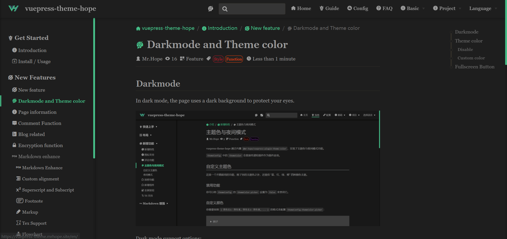

# Darkmode and Theme color

## Darkmode

In dark mode, the page uses a dark background to protect your eyes.



Dark mode support options:

- `'auto-switch'`: "off | automatic | on" switch (default)
- `'switch'`: "Close | Open" toggle switch
- `'auto'`: Automatically decide whether to apply dark mode based on user device's color-scheme or current time
- `'disable'`: disable dark mode

## Theme color

This is an out-of-the-box feature that offers five theme color "red, blue, green, orange and purple" besides your theme color.

### Disable

You can disable it by setting the theme field's `themeConfig.themeColor` to false.

### Custom color

You need to configure `themeConfig.themeColor` in the format `colorname1: colorvalue, colorname2: colorvalue, ... }`:

::: details Example

```js {5-10}
// .vuepress/config.js
module.exports = {
  themeConfig: {
    themeColor: {
      blue: "#2196f3",
      red: "#f26d6d",
      green: "#3eaf7c",
      orange: "#fb9b5f",
    },
  },
};
```

:::

In order to let the stylus compiler to work, you also need to assign the color variable to `$colorPicker` and write it to `.vuepress/styles/palette.styl`:

::: details Example

```stylus
// .vuepress/styles/palette.styl
$colorPicker = {
   colorName1: red,
   colorName2: yellow,
   colorName3: blue
}
```

:::

## Fullscreen Button

Enabled by default, you can disable it by setting `fullscreen` to `false` in the theme configuration.

::: tip
If the current browser does not support full screen, the full screen button is automatically hidden.
:::

```js {4}
// .vuepress/config.js
module.exports = {
  themeConfig: {
    fullscreen: false, // Enable by default
  },
};
```
